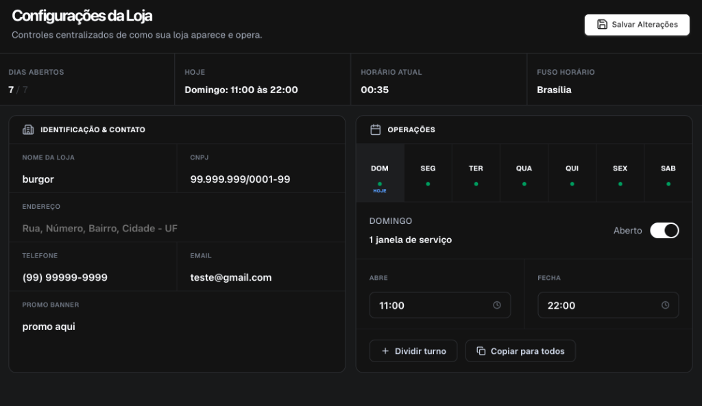
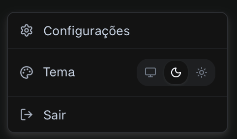

**ZEST MENU** is a modern digital menu system designed for restaurants looking to manage and display their products with visual excellence and agility.

### Key Features

- **Visual Personalization & Simulator**: Real-time updates of the store's cover banner and logo with an integrated mobile phone mockup simulator.
  
  

- **Store Settings Panel**: Control over restaurant opening days, opening hours, and operating shifts.
  
  

- **Menu Management**: Creation and sorting of custom menus and categories in an interactive way.
  
  

- **Detailed Dish Registration**: Support for photos, descriptions, pricing, popularity tags, alongside an advanced fields panel (preparation time, calories, allergens, and dietary restrictions).
  
  

- **Authentication & Security**: Complete login and user registration area, integrated with access control (JWT/CSRF/Nonce tokens).
  
  

- **Modern & Responsive Interface**: Premium design supporting Dark Mode, Light Mode, and automatic synchronization with the operating system's theme.
  
  

- **Under Development**: Customer ordering system via personalized link and QR Codes (QRCode).

This project is split into a Frontend client (React + Vite) and a Backend server (Node.js + Express + MySQL).

## Project Structure

- `/frontend`: Client application built with React, Vite, and CSS Modules.
- `/backend`: Secure API server built with Express, managing authentication, CSRF/Nonce security tokens, MySQL database, and media uploads.
- `/db_backup.sql`: MySQL database backup dump.

## How to Run Locally

### 1. Start the Backend
Navigate to the `backend` folder, install dependencies, and start the server:
```bash
cd backend
npm install
npm run start
```
*The server starts by default on port `3002`.*

### 2. Start the Frontend
Navigate to the `frontend` folder, install dependencies, and start the development server:
```bash
cd frontend
npm install
npm run dev
```
*The frontend starts by default on port `5174` (or similar).*
