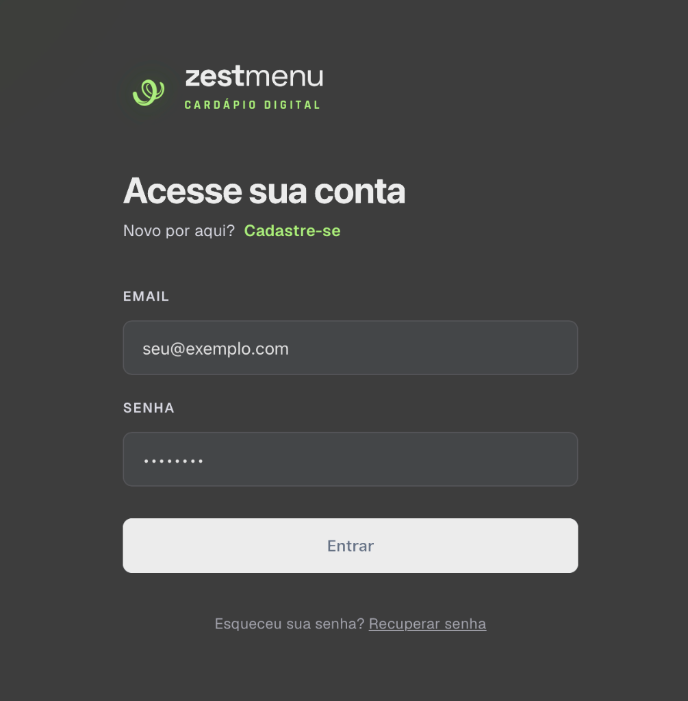
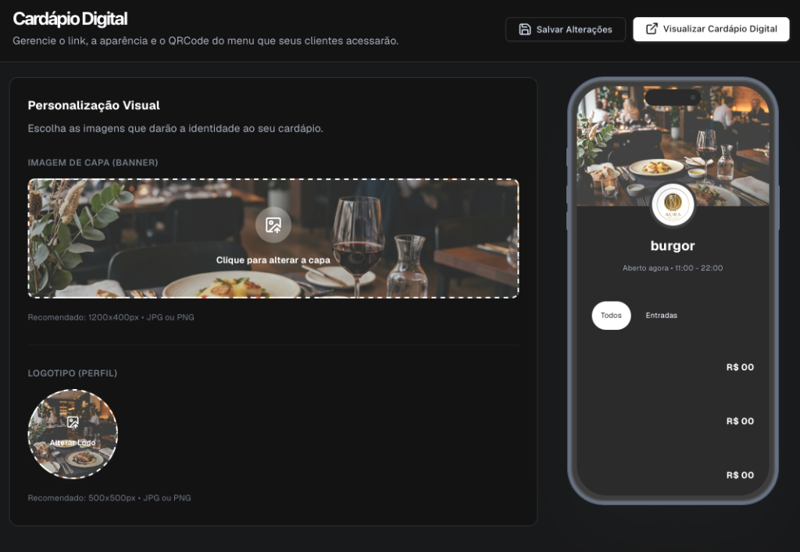
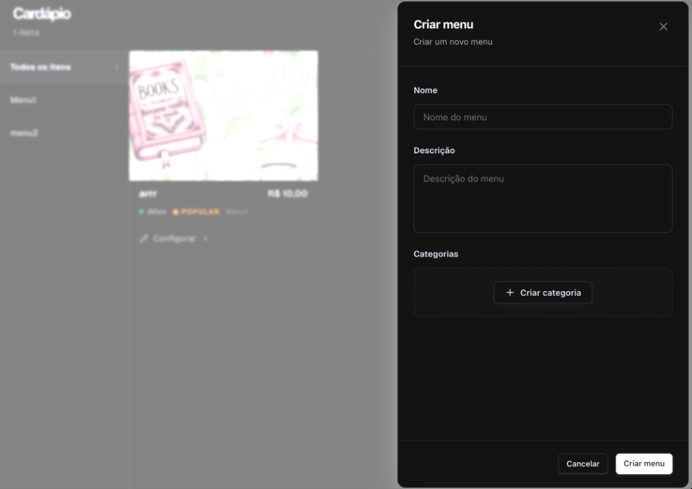
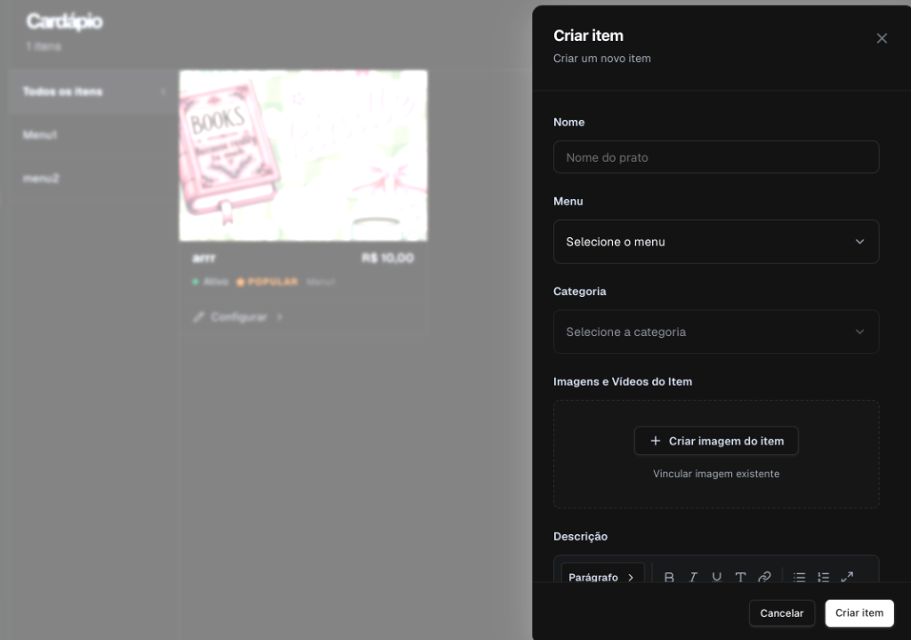

<p align="center">
  
</p>

<h1 align="center">Zest Menu — Cardápio Digital</h1>

<p align="center">
  Sistema completo de cardápio digital para restaurantes com painel administrativo, gestão de itens, categorias e simulador de celular em tempo real.
</p>

<p align="center">
  
  
  
  
  
</p>

---

## Funcionalidades

- **Simulador de Cardápio**: Preview em tempo real do cardápio em formato mobile
- **Personalização Visual**: Banner de capa, logotipo e temas (Dark/Light Mode)
- **Gestão de Cardápio**: Categorias, subcategorias e itens com drag-and-drop
- **Cadastro Avançado de Pratos**: Fotos, preço, calorias, alérgenos, tempo de preparo
- **Autenticação Segura**: JWT + CSRF + Nonce + Rate Limiting + Helmet
- **Painel de Configurações**: Horários de funcionamento, endereço, dados da loja
- **Upload de Imagens**: Upload seguro com validação de tipo e tamanho

---

## Screenshots

|  Personalização  |  Cardápio  |  Cadastro de Prato  |
|:---:|:---:|:---:|
|  |  |  |

---

## Estrutura do Projeto

```
ZESTAQUI/
├── frontend/          # React + Vite (SPA)
│   ├── src/
│   │   ├── pages/     # Register, ItemsPage, DigitalMenu, StoreSettings
│   │   ├── components/# Sidebar, etc.
│   │   └── assets/    # Ícones e imagens
│   └── vite.config.js
├── backend/           # Node.js + Express 5
│   ├── index.js       # Servidor principal (rotas, middlewares, segurança)
│   ├── db.js          # Pool MySQL + Circuit Breaker
│   ├── src/database/  # Auto-criação das tabelas
│   ├── uploads/       # Diretório de uploads de imagens
│   └── .env.example   # Modelo de variáveis de ambiente
├── db_backup.sql      # Schema do banco de dados (backup)
└── README.md
```

---

## Instalação e Execução

### Pré-requisitos

| Ferramenta | Versão Mínima |
|:--|:--|
| [Node.js](https://nodejs.org/) | v18+ |
| [MySQL](https://dev.mysql.com/downloads/) ou [MariaDB](https://mariadb.org/) | 8.0+ / 10.4+ |
| npm | v9+ (vem com o Node.js) |

### Passo 1 — Clonar o Repositório

```bash
git clone https://github.com/thelustosa/cardapio-online.git
cd cardapio-online
```

### Passo 2 — Configurar o Banco de Dados

1. Certifique-se de que o MySQL/MariaDB está rodando na sua máquina
2. Crie um banco de dados (opcional — o sistema cria automaticamente):
```bash
mysql -u root -p -e "CREATE DATABASE IF NOT EXISTS zestmenu_db;"
```

### Passo 3 — Configurar o Backend

```bash
cd backend

# Copie o modelo de variáveis de ambiente
cp .env.example .env

# Instale as dependências
npm install
```

Edite o arquivo `.env` com seus dados:

```env
# Banco de Dados
DB_HOST=127.0.0.1
DB_USER=root
DB_PASSWORD=       # Sua senha do MySQL (deixe vazio se não tiver)
DB_NAME=zestmenu_db

# Segurança — MUDE em produção!
JWT_SECRET=MUDE_ESTA_CHAVE_EM_PRODUCAO

# Ambiente
NODE_ENV=development
PORT=3002
```

> **Dica**: Para gerar chaves seguras, use:
> ```bash
> node -e "console.log(require('crypto').randomBytes(64).toString('hex'))"
> ```

### Passo 4 — Configurar e Iniciar o Frontend

```bash
cd ../frontend

# Instale as dependências
npm install
```

### Passo 5 — Iniciar o Projeto

Abra **dois terminais** e execute:

**Terminal 1 — Backend:**
```bash
cd backend
npm start
```
Você deve ver:
```
Banco de dados "zestmenu_db" garantido.
Pool conectado ao banco "zestmenu_db" com sucesso!
Secured Server running on port 3002
```

**Terminal 2 — Frontend:**
```bash
cd frontend
npm run dev
```
Você deve ver:
```
VITE v8.x.x ready in XXX ms
➜ Local: http://localhost:5174/
```

### Passo 6 — Acessar

Abra o navegador em **http://localhost:5174** e crie sua conta!

---

## Configuração de Produção

Para deploy em produção (ex: Hostinger, VPS, etc.):

1. Altere `NODE_ENV=production` no `.env`
2. Gere chaves JWT e de criptografia fortes
3. Configure seu domínio no CORS (arquivo `index.js`, função `isAllowedOrigin`)
4. Build do frontend:
```bash
cd frontend
npm run build
```
5. Sirva a pasta `frontend/dist/` com seu servidor web (Apache, Nginx, etc.)

---

## Segurança

O backend implementa as seguintes camadas de segurança:

| Camada | Tecnologia |
|:--|:--|
| Autenticação | JWT (HttpOnly Cookies) |
| Anti-CSRF | Double Submit (Cookie + Header) |
| Anti-Replay | Nonce Tokens (uso único) |
| Rate Limiting | express-rate-limit (global + auth) |
| Headers HTTP | Helmet (HSTS, CSP, XSS, etc.) |
| Sanitização | XSS + express-validator |
| Circuit Breaker | Proteção contra falhas cascata no DB |
| Upload Seguro | Validação de magic bytes + multer |

---

## Licença

Este projeto está sob a licença MIT. Veja o arquivo [LICENSE](LICENSE) para mais detalhes.
